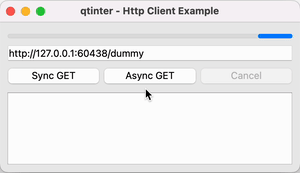

Examples
========

This page shows a few examples that demonstrate the usage of :mod:`qtinter`.

The source code is listed for each example.  Lines that demonstrate the usage
of :mod:`qtinter`'s API are highlighted.

.. contents::
   :depth: 1
   :local:

.. _hello-world-example:

Hello World Example
-------------------

This is a minimal example that uses :func:`asyncio.sleep` to draw an
animation in a Qt app.

Source code:

.. toggle::

   .. literalinclude:: ../examples/hello_world.py
      :language: python
      :emphasize-lines: 4,15,33
      :linenos:

.. _http-client-example:

Http Client Example
-------------------

This example shows how to download a web page asynchronously using the
``httpx`` module and optionally cancel the download.

Source code:

.. toggle::

   .. literalinclude:: ../examples/http_client.py
      :language: python
      :emphasize-lines: 4,68,218
      :linenos:

.. _read-out-example:

Read Out Example
----------------

.. _QtTextToSpeech: https://doc-snapshots.qt.io/qt6-dev/qttexttospeech-index.html

This example shows how to use a Qt component (`QtTextToSpeech`_)
in asyncio-driven code.

Sample output (on macOS 12):

.. code-block:: console

   $ python read_out.py -h
   usage: read_out.py [options]
   Read out text from stdin.
   Options:
       -e          Echo each line before reading it out
       -h          Show this screen and exit
       -l locale   One of en_US, fr_FR (default: en_US)
       -p pitch    Number between -1.0 and +1.0 (default: 0.0)
       -r rate     Number between -1.0 and +1.0 (default: 0.0)
       -v voice    One of Alex, Fiona, Fred, Samantha, Victoria (default: Alex)

.. note::

   On Unix, press ``Ctrl+D`` to terminate input.  On Windows, press ``Ctrl+Z``.

.. note::

   On macOS, the program 'steals' the focus of the terminal window
   when started.  You have to click in the terminal window to input text.
   This is a behavior of the ``QGuiApplication`` class and not specific
   to :mod:`qtinter`.

Source code:

.. toggle::

   .. literalinclude:: ../examples/read_out.py
      :language: python
      :emphasize-lines: 5,21,72
      :linenos:

.. _where-am-i-example:

Where am I Example
------------------

This example implements a command line utility that prints the current
geolocation.

Sample output:

.. code-block:: console

   $ python where_am_i.py
   12° 34' 56.7" N, 98° 76' 54.3" E, 123.456m

.. _QtPositioning: https://doc-snapshots.qt.io/qt6-dev/qtpositioning-index.html

The example shows how to use a Qt component (`QtPositioning`_) from
asyncio-driven code.  The example also shows two coding patterns:

#. Use :external:meth:`asyncio.loop.call_soon` to invoke a Qt method
   *after* installing signal handlers (line 22).

#. Use :func:`asyncio.wait` to wait for the first of multiple Qt
   signals (lines 29-30).

Source code:

.. toggle::

   .. literalinclude:: ../examples/where_am_i.py
      :language: python
      :emphasize-lines: 4,25,26,46
      :linenos:

