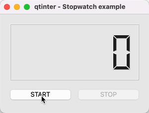

.. currentmodule:: qtinter

Usage Guide
===========

This page explains how to use :mod:`qtinter`.

.. _using-using-asyncio-from-qt:

Using :func:`using_asyncio_from_qt`
-----------------------------------

.. _using-using-qt-from-asyncio:

Using :func:`using_qt_from_asyncio`
-----------------------------------

.. _using-asyncslot:

Connecting coroutines to Qt signals
-----------------------------------

Even inside :func:`using_asyncio_from_qt` or :func:`using_qt_from_asyncio`,
a :term:`coroutine function` (whether decorated with ``Slot``/``pyqtSlot``
or not) cannot be *directly* used as a Qt slot, because calling it merely
returns a coroutine object rather than performing real work.

To perform real work, the coroutine object returned by the coroutine
function must be wrapped in an :class:`asyncio.Task` to be scheduled
for execution.

We show below three coding patterns to do this.  We demonstrate these
patterns in the context of a simple *Stopwatch* app that looks like
below:

The app has a START button, a STOP button and an LCD display to show
the time elapsed.  The 'core' of the app runs a coroutine (``_tick``)
to update the LCD display:

.. code-block:: python

   async def _tick(self):
       t0 = time.time()
       while True:
           t = time.time()
           self.lcdNumber.display(format(t - t0, ".1f"))
           await asyncio.sleep(0.05)

The three patterns differ in how they connect the button signals to
this coroutine.

.. _using-asyncslot-without:

Pattern 1: use asyncio's API directly
~~~~~~~~~~~~~~~~~~~~~~~~~~~~~~~~~~~~~

If you are comfortable with asyncio's API, you may use that to
schedule and manipulate coroutines directly.  No additional API
is required.

The *Stopwatch 1* example demonstrates this pattern.  The key
points are:

- The START button is connected to a plain slot (``_start``). 
  This slot updates the UI states, schedules the coroutine via
  :func:`asyncio.create_task`, and hooks the "done callback"
  of the task to a clean-up routine.

  .. code-block:: python

     def _start(self):
         self.startButton.setEnabled(False)
         self.stopButton.setEnabled(True)
         self.task = asyncio.create_task(self._tick())
         self.task.add_done_callback(self._stopped)

- The STOP button is connected to a plain slot (``_stop``) that
  attempts to stop the coroutine by calling :meth:`asyncio.Task.cancel`.

  .. code-block:: python

     def _stop(self):
         self.task.cancel()

- The clean-up routine (``_stopped``) restore the UI states.

  .. code-block:: python

     def _stopped(self, task: asyncio.Task):
         self.startButton.setEnabled(True)
         self.stopButton.setEnabled(False)

Although the code is slightly verbose, its semantics are well-known,
thus saving you (and the future reader) the effort to learn the details
of another API, such as :func:`asyncslot`.

.. note::

   Installing a "done callback" in ``_start()`` is necessary because
   the task might be cancelled before it starts running.  Also, code
   that disables the START button cannot be moved into ``_tick()``
   because it must be executed immediately when the button is clicked.

.. _using-asyncslot-decorator:

Pattern 2: use :class:`asyncslot` as a decorator
~~~~~~~~~~~~~~~~~~~~~~~~~~~~~~~~~~~~~~~~~~~~~~~~

If you are unfamiliar with asyncio's API or prefer Qt's coding style,
you may *decorate* a coroutine function with :class:`asyncslot` and
connect the decorated function to a Qt signal.

*A coroutine function decorated with* :class:`asyncslot` *becomes a regular
function*.  When the decorated function is called, the original coroutine
function is called with the same arguments to return a coroutine object.
The coroutine object is then wrapped in an :class:`asyncio.Task` and
executed immediately until the first ``yield``, ``return`` or ``raise``,
whichever comes first.  The remainder of the coroutine is scheduled for
later execution.

The *Stopwatch 2* example demonstrates this pattern.  The key points are:

- The START button is connected to a coroutine function (``_start``)
  decorated with :class:`asyncslot`.  When invoked, the coroutine
  stores the running task (for cancellation later), updates UI states,
  performs the real work, and restores UI states before it returns.

  .. code-block:: python

     @qtinter.asyncslot
     async def _start(self):
         self.task = asyncio.current_task()
         self.startButton.setEnabled(False)
         self.stopButton.setEnabled(True)
         try:
             await self._tick()
         finally:
             self.startButton.setEnabled(True)
             self.stopButton.setEnabled(False)

- The STOP button is connected to a plain slot (``_stop``) that
  attempts to stop the coroutine by calling :meth:`asyncio.Task.cancel`.

  .. code-block:: python

     def _stop(self):
         self.task.cancel()

This pattern has the advantage that start-up and clean-up code is
put together in a structured way, making the code easier to read
and reason about.

This is made possible by a key semantic feature of :func:`asyncslot`
that is different from :func:`asyncio.create_task`: the first *step*
of a task created by :func:`asyncslot` is executed immediately rather
than scheduled for later execution.  This feature is designed to work
with a common coding pattern where some work is done immediately in
response to a signal, such as updating UI states in the above example.

The main drawback of using :class:`asyncslot` as a decorator is that
it may be surprising to the casual reader that a decorated coroutine
function is in fact a regular function.  For example, calling the
decorated function immediately executes the coroutine without the need
to await it.  In addition, awaiting the returned :class:`asyncio.Task`
has similar effect as awaiting a true coroutine, but there are subtle
differences between their semantics which may surprise an unprepared
caller.

.. note::

  If a coroutine function decorated with :func:`asyncslot` is called
  from a coroutine (directly or indirectly), the coroutine's task is
  'suspended' when the call begins and 'resumed' after the call returns.
  This extension to asyncio's semantics is created to make
  :func:`asyncslot` more useful in practice; see :ref:`eager-execution`
  for details.

.. _using-asyncslot-wrapper:

Pattern 3: use :func:`asyncslot` as a wrapper
~~~~~~~~~~~~~~~~~~~~~~~~~~~~~~~~~~~~~~~~~~~~~

This pattern is similar to the previous one, except that the coroutine
function is not decorated by :class:`asyncslot` upon definition but
wrapped by :func:`asyncslot` when being connected to the signal.

The *Stopwatch 2* example demonstrates this pattern.  Key points are:

- ``_start`` is identically defined as in the previous pattern,
  except that it is not decorated by :class:`asyncslot` so remains a
  true coroutine function.

- ``_start`` is connected to the ``clicked`` signal of the START
  button by wrapping it in :func:`asyncslot`.

  .. code-block:: python

     def __init__(self):
         ...
         self.startButton.clicked.connect(qtinter.asyncslot(self._start))
         ...

- The rest code is identical to the previous pattern.

This pattern offers the same semantics as the decorator pattern, with
the additional benefit that a coroutine function remains async, which
avoids surprises.  The code is also more compact, especially if the
coroutine function is already defined.

One subtlety with the wrapper pattern should be noted:  When a bound
method wrapped by :func:`asyncslot` is connected to a Qt signal, a
strong reference to the receiver object is held by the connection,
which may keep the receiver object alive longer than expected if a
reference cycle is created.

In contrast, when a bound method *decorated* with :class:`asyncslot`
is connected to a Qt signal, a weak reference to the receiver object
is held by the connection, and the connection is automatically destroyed
when the receiver object is deleted.

This difference should be taken into account when choosing to wrap
or to decorate a coroutine function with :class:`asyncslot`.

.. _using-asyncsignal:

Awaiting Qt signals from a coroutine
------------------------------------

.. _using-modal:

Executing a nested Qt event loop
--------------------------------

